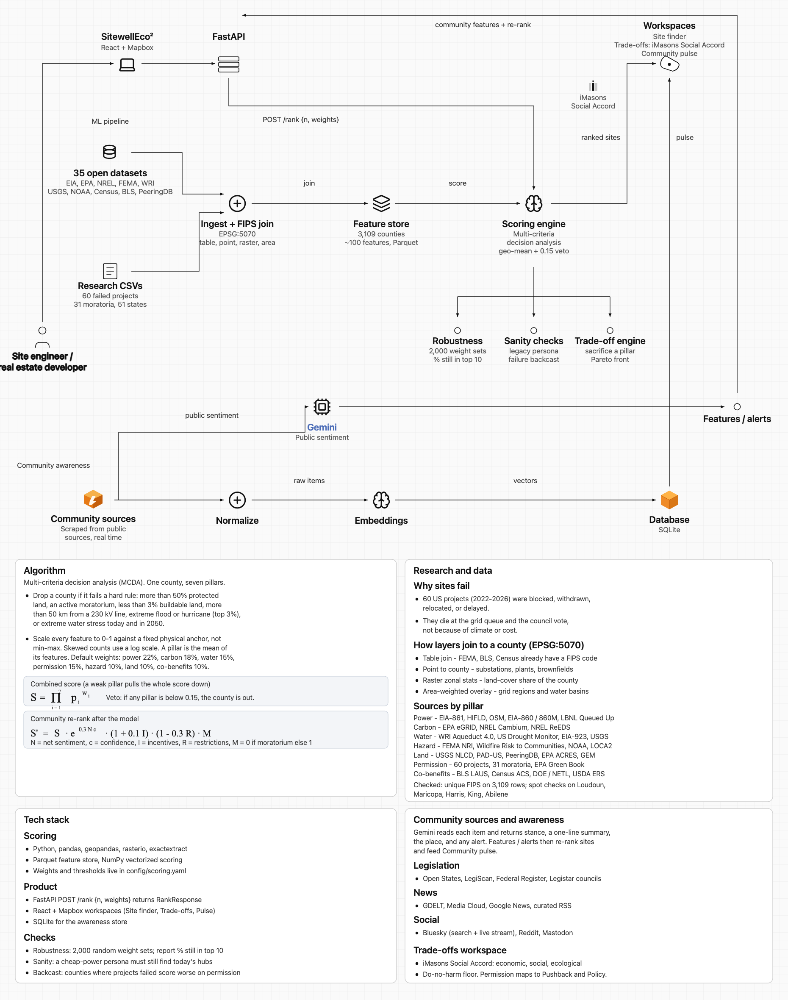
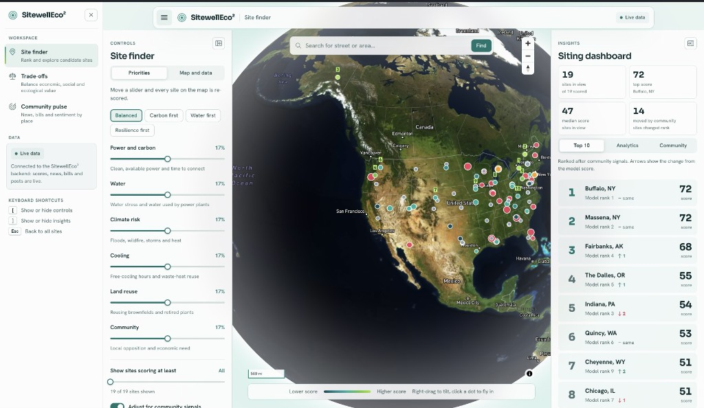
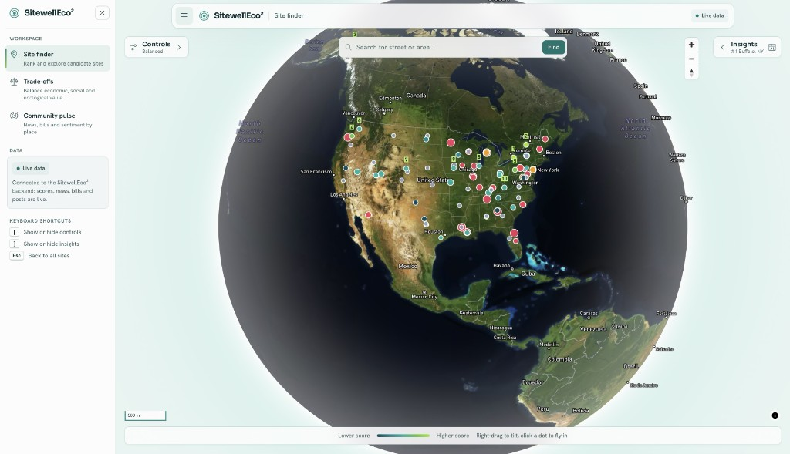
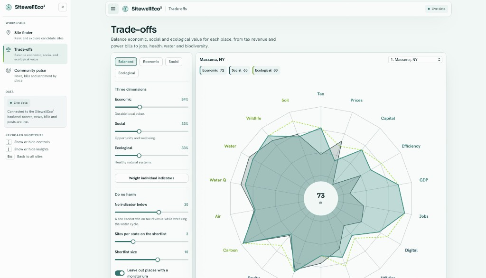
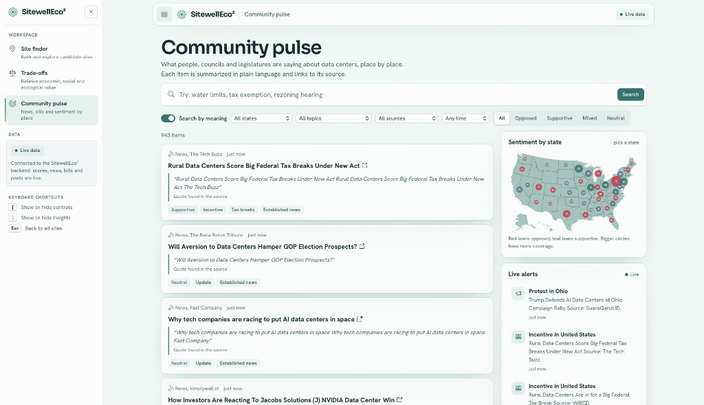

# SitewellEco²

**Where should America’s next sustainable data center be built?**

SitewellEco² is a siting platform for digital infrastructure. It ranks candidate US sites on clean power, water, climate risk, land reuse and community support, then keeps watching the place after the shortlist is drawn — so site engineers and developers can see how well a project fits, what it gives back, and when local laws or sentiment change.

Three workspaces share one ranking and one awareness pipeline:

1. **Site finder** — rank and explore candidate sites on a globe or satellite map
2. **Trade-offs** — balance economic, social and ecological value with a do-no-harm floor
3. **Community pulse** — news, bills and public posts, summarized in plain language and linked to the source

```
backend/              FastAPI: awareness pipeline, scoring integration, Social Accord engine, API
frontend/             React + Vite: landing page, Site finder, Trade-offs, Community pulse
ml_service_example/   Stub ML service with the exact contract the backend expects
docs/                 architecture, DATA_SOURCES.md, INTEGRATION.md, screenshots
```

## Architecture

SitewellEco² answers a simple question: where should a data center be built, and how will that place feel about it?

A site engineer or real estate developer uses the app. **FastAPI** calls the scoring engine with `POST /rank` and slider weights. The shortlist opens three workspaces: Site finder, Trade-offs, and Community pulse.



The diagram is also in `docs/architecture.svg`.

### Algorithm

Multi-criteria decision analysis (MCDA). One county, seven pillars.

- Drop a county if it fails a hard rule: more than 50% protected land, an active moratorium, less than 3% buildable land, more than 50 km from a 230 kV line, extreme flood or hurricane (top 3%), or extreme water stress today and in 2050.
- Scale every feature to 0–1 against a fixed physical anchor, not min-max. Skewed counts use a log scale. A pillar is the mean of its features.
- Default weights: power 22%, carbon 18%, water 15%, permission 15%, hazard 10%, land 10%, co-benefits 10%.

Combined score (a weak pillar pulls the whole score down):

$$S = \prod_{i=1}^{7} p_i^{w_i}$$

Veto: if any pillar is below 0.15, the county is out.

Community re-rank after the model:

$$S' = S \cdot e^{0.3Nc} \cdot (1 + 0.1I) \cdot (1 - 0.3R) \cdot M$$

- \(N\) = net sentiment \(c\) = confidence \(I\) = incentives \(R\) = restrictions
- \(M = 0\) if there is an active moratorium, else \(1\)

### Research and data

**Why sites fail**

- 60 US projects (2022–2026) were blocked, withdrawn, relocated, or delayed.
- They die at the grid queue and the council vote, not because of climate or cost.

**How layers join to a county (EPSG:5070)**

- Table join — FEMA, BLS, Census already have a FIPS code
- Point to county — substations, plants, brownfields
- Raster zonal stats — land-cover share of the county
- Area-weighted overlay — grid regions and water basins

**Sources by pillar**

- Power — EIA-861, HIFLD, OSM, EIA-860 / 860M, LBNL Queued Up
- Carbon — EPA eGRID, NREL Cambium, NREL ReEDS
- Water — WRI Aqueduct 4.0, US Drought Monitor, EIA-923, USGS
- Hazard — FEMA NRI, Wildfire Risk to Communities, NOAA, LOCA2
- Land — USGS NLCD, PAD-US, PeeringDB, EPA ACRES, GEM
- Permission — 60 projects, 31 moratoria, EPA Green Book
- Co-benefits — BLS LAUS, Census ACS, DOE / NETL, USDA ERS

Checked: unique FIPS on all 3,109 rows; spot checks on Loudoun, Maricopa, Harris, King, Abilene.

### Tech stack

**Scoring**

- Python, pandas, geopandas, rasterio, exactextract
- Parquet feature store, NumPy vectorized scoring
- Weights and thresholds live in `config/scoring.yaml`

**Product**

- FastAPI `POST /rank {n, weights}` returns `RankResponse`
- React + Mapbox workspaces (Site finder, Trade-offs, Pulse)
- SQLite for the awareness store

**Checks**

- Robustness: 2,000 random weight sets; report % still in top 10
- Sanity: a cheap-power persona must still find today's hubs
- Backcast: counties where projects failed score worse on permission

### Community sources and awareness

Gemini reads each item and returns stance, a one-line summary, the place, and any alert. Features / alerts then re-rank sites and feed Community pulse.

- **Legislation** — Open States, LegiScan, Federal Register, Legistar councils
- **News** — GDELT, Media Cloud, Google News, curated RSS
- **Social** — Bluesky (search + live stream), Reddit, Mastodon

Trade-offs uses the **iMasons Social Accord** (economic, social, ecological) with a do-no-harm floor. Permission risk maps to iMasons Pushback and Policy.

## The product

### Site finder

Ranks every candidate site with the scoring model, then moves sites up or down from what their communities are saying. Open the globe to scan the country, fly into a point for a deep dive, or add a Mapbox token for satellite streets and address search. Sliders for power, water, climate, cooling, land and community re-score the map live.





### Trade-offs

The **iMasons Social Accord** evaluates each place across **18 indicators** in three dimensions — economic, social and ecological. Weight the dimensions (or the individual indicators), set a do-no-harm floor so one gain cannot hide a wrecked water cycle, and read the radar for the shortlist.



### Community pulse

What people and legislatures are saying about data centers, place by place. Each item is summarized in plain language and linked to its source. Filter by state, topic, source and stance; watch the US map and live alerts for protests, incentives and hearings.



## How it works

1. Collect public data — grid carbon, water stress, climate risk, land and transmission from government datasets.
2. Score every site — the model weighs each factor and ranks candidates on sustainability.
3. Listen to communities — news, bills, council agendas and public posts adjust the ranking up or down.
4. Weigh trade-offs — balance economic, social and ecological value, with a do-no-harm floor.
5. Stay alerted — hear about moratoria, incentives and shifts in local sentiment as they happen.

Sources are weighted by reliability: official records first, then established news, advocacy groups, and public posts counted by region, never by person. Every signal links back to its public source.

## Run it

Backend (Python 3.11+):

```bash
cd backend
python -m venv .venv && source .venv/bin/activate
pip install -r requirements.txt
cp .env.example .env            # add keys as you get them; everything is optional
uvicorn app.main:app --reload   # http://localhost:8000/docs
```

Frontend (Node 18+), in a second terminal:

```bash
cd frontend
npm install
cp .env.example .env            # optional: VITE_MAPBOX_TOKEN for satellite maps
npm run dev                     # http://localhost:5173, proxies /api to :8000
```

With the backend down, the frontend shows built-in sample data and says so on every page. Leave `VITE_MAPBOX_TOKEN` empty to keep the hologram globe; set a public Mapbox token (`pk.…`) and the site finder uses satellite street maps with search.

## Collect real data

```bash
cd backend
python -m app.cli sources                    # what is enabled, and which keys are missing
python -m app.cli collect --source gdelt     # one source now (no key needed)
python -m app.cli collect                    # every enabled source, then AI analysis
python -m app.cli live                       # Bluesky posts in real time
python -m app.cli features --fips 51107      # community features for one county
```

Sources that work with no key: GDELT, Google News RSS, curated RSS, Federal Register, Mastodon, Bluesky live
stream. Add `OPENSTATES_API_KEY` and `LEGISCAN_API_KEY` (both free) for state bills, and `GEMINI_API_KEY` for AI
analysis. To keep collecting in the background, set `ENABLE_SCHEDULER=true` and `ENABLE_JETSTREAM=true`.

See `docs/DATA_SOURCES.md` for the full source list and access rules.

## Plug in the ML model

See `docs/INTEGRATION.md`. In short: return `RankResponse` JSON from `POST /rank`, set
`SCORING_PROVIDER=http` and `ML_SERVICE_URL`, and the site finder, trade-offs and community re-ranking use it.

## Deploy as one server

```bash
cd frontend && npm run build   # writes frontend/dist
cd ../backend && uvicorn app.main:app --host 0.0.0.0 --port 8000
```

FastAPI serves the built frontend at `/` and the API at `/api`. Protect `POST /api/awareness/run` before
exposing the server publicly.

## Tests

```bash
cd backend && pytest
```

Tests run offline: collector parsers use recorded-shape payloads and the pipeline runs on keyword rules.

## API at a glance

| Route | What it does |
| --- | --- |
| `GET /api/scoring/top?n=10&community=true` | Top sites, re-ranked with community signals |
| `POST /api/scoring/rank` | Same, with pillar weights from the sliders |
| `GET /api/scoring/sites/{id}` | One site with its community pulse |
| `POST /api/tradeoff/evaluate` | Social Accord shortlist: 18 indicators, three dimensions, do-no-harm floor |
| `GET /api/awareness/search` | Search news, bills and posts (semantic or keyword) with filters |
| `GET /api/awareness/regions/{state or FIPS}` | Pros, cons, policies and upcoming events for a place |
| `GET /api/awareness/map` | Community indices by state or county |
| `GET /api/awareness/events` | GeoJSON of recent events for the map |
| `GET /api/awareness/alerts`, `GET /api/awareness/stream` | Alert history, and live alerts (server-sent events) |
| `GET/POST/DELETE /api/awareness/watchlists` | Regions and alert types to watch, with optional webhooks |
| `GET /api/integration/community-features` | Per-county features for the ML team |
| `GET /api/awareness/status` | Source health, counts, AI chain |

Sample sites in the mock scoring provider and sample items in the frontend are illustrative, not real data.
